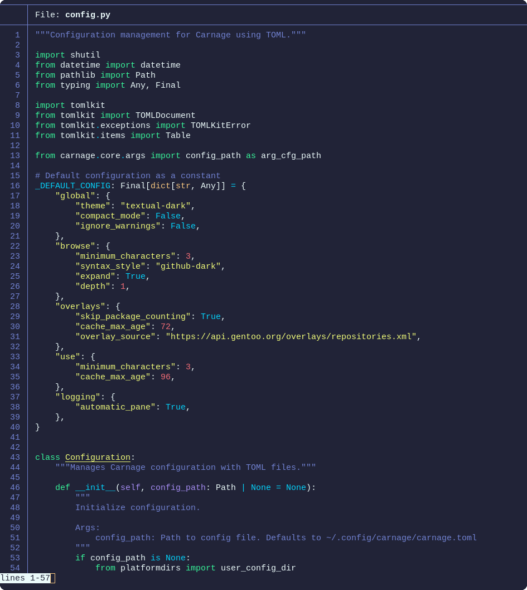
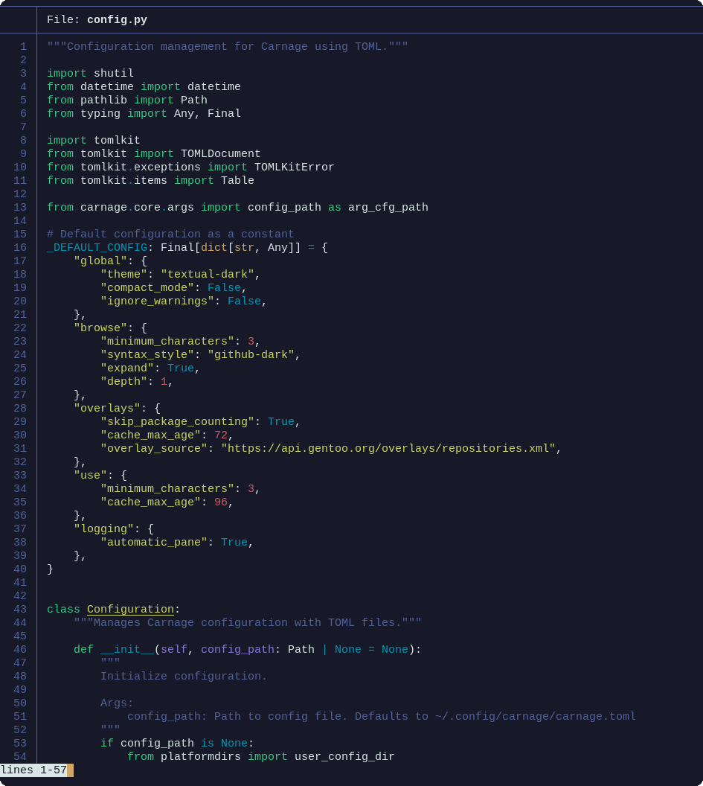
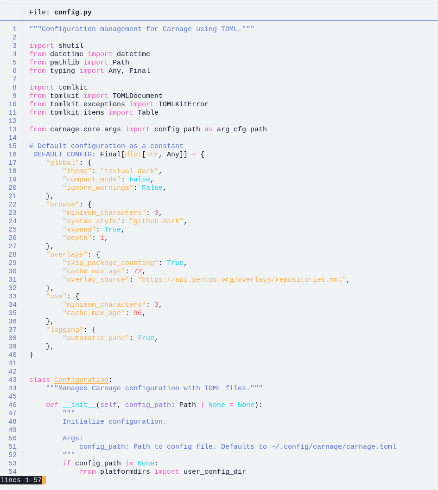

<!-- DO NOT CHANGE THIS -->
<p align="center">
  
</p>
<p>
  Eldritch is a community-driven dark theme inspired by Lovecraftian horror. With tones from the dark abyss and an emphasis on green and blue, it caters to those who appreciate the darker side of life.
</p>

Main Theme repo can be found [here](https://github.com/eldritch-theme/eldritch)

### Showcase

<details>
    <summary>🦑 Cthulhu (Default)</summary>
    
</details>
<details>
    <summary>🌀 Abyss (Darker)</summary>
    
</details>
<details>
    <summary>🌅 Dusk (Light)</summary>
    
</details>

### Installation

1. Download your preferred variant from [themes](themes) and copy into the `~/.config/bat/themes` directory
2. Execute the following command to rebuild `bat`'s cache:
   ```sh
   bat cache --build
   ```
3. Edit your configuration file (`~/.config/bat/config`) and add your preferred variant:
   ```
   --theme="Eldritch Dusk"

   --theme="Eldritch Cthulhu"

   --theme="Eldritch Abyss"
   ```
